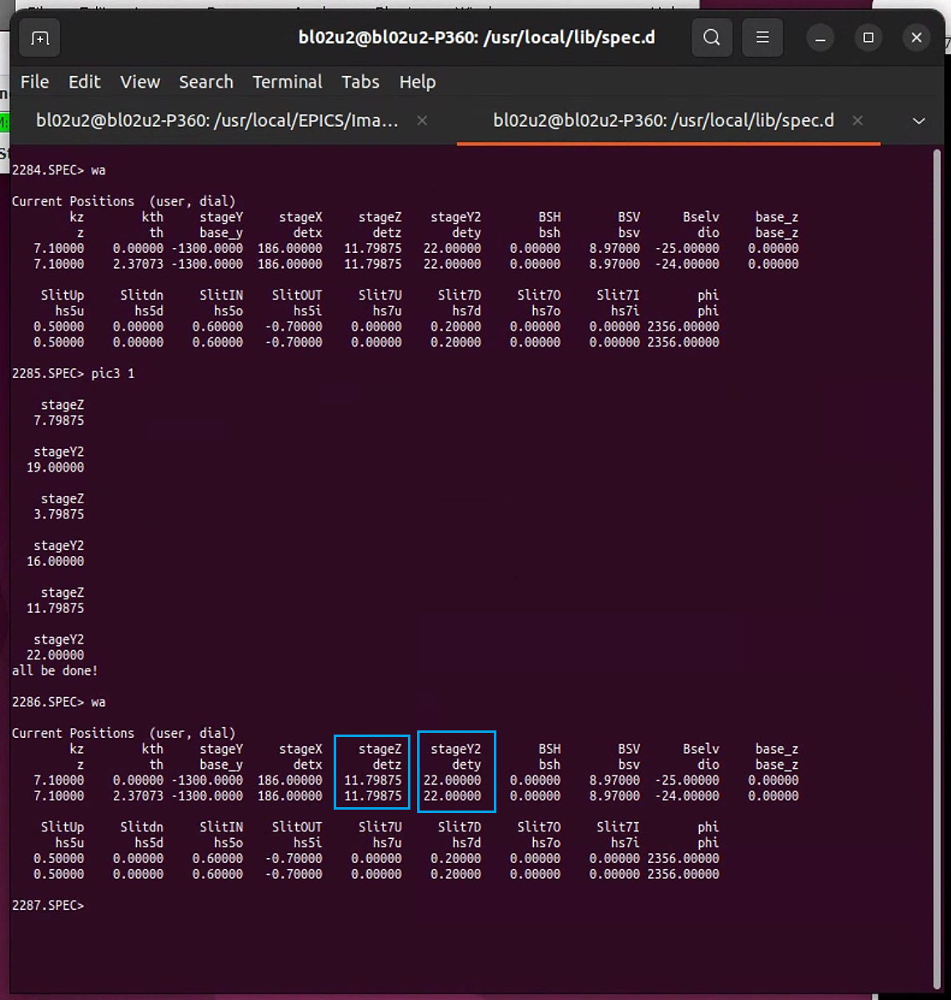
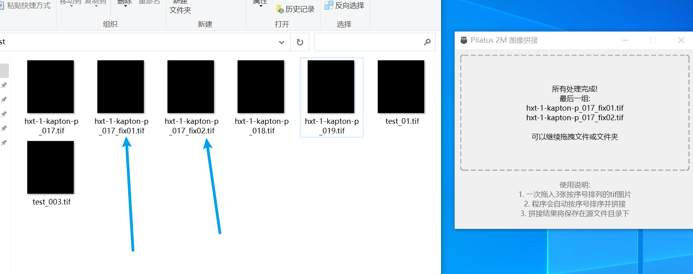
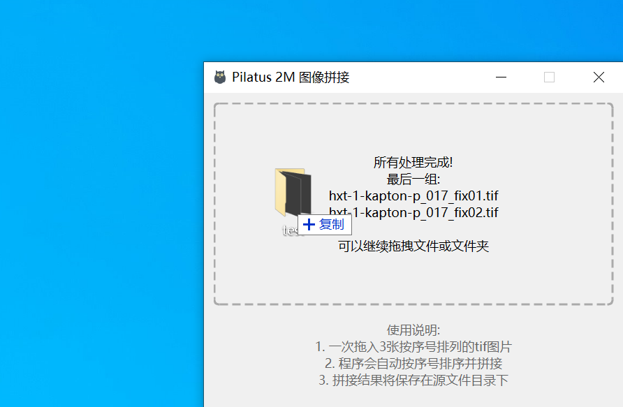
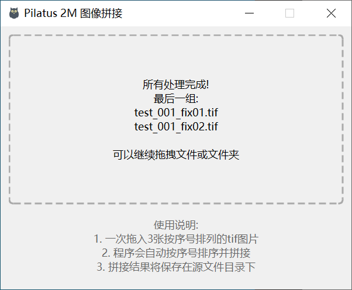

# Pilatus_2M_Image_Stitching

# 介绍

该部分代码是一个通过电机移动，消去PIlatus 2M的GAP区域的解决方案。在SSRF BL02U2线站完成该代码的编写和测试。由于PILATUS 2M探测器电机具有GAP区域，会影响很多二维X射线衍射数据的分析。由于GAP区域是"井"字形。因此需要通过三张不同位置电机的拼接才能彻底消除图像中心的GAP区域。本实验的实验原理是通过探测器电机带动探测器移动，采集不同位置的三张图像，通过该程序拼接并消除GAP。

# 操作指南
该代码在BL02U2线站通过验证，其他线站配置可能不同。

以下步骤将具体解释如何实现拼接以消除GAP:
## 1、脚本安装使用
将
```
spec_script/pic3.mac
```
文件拷贝到SPEC电脑上，并通过
```
do pic3.mac
```
即可在SPEC中使用该脚本。
(注：BL02U2已安装该脚本，无须重复安装。)

## 2、验证电机位置
填写好曝光时间、文件路径、文件名称等参数

在SPEC中输入
```
wa
```

记录图中detz、dety当前的电机位置，为了后续采集三张图像，电机是否可以回到初始位置。

在命令行中输入一下命令：此时time是一个正整数，比如"pic3 1"代表采集三张图像，曝光时间为1s。
```
pic3 time
```
当移动完成后，在输入
```
wa
```

经过验证在pic3移动前后电机并未碰到限位，且回到拼接前的初始位置，说明该方案的可行性。

若电机并未回到初始位置，那么调节电机到合适的位置进行后续实验

<span style="color:red">该部分验证是后续拼接实验的基础，请仔细验证。</span>

## 3、拼接软件运行
该软件的运行方案有两种：通过源代码、通过打包的软件进行拼接
### 3.1 通过源代码运行
通过源代码运行不需要考虑设备平台，但需要有一定的编程能力，程序的主入口为mian.py。

但在其他机器上可能会运行报错，因为缺少python安装包，因此不具备python编程能力的人员不推荐该方案。
### 3.1 通过安装包运行
将以下文件拷贝到任意windows电脑均可运行：

```
dist/Pilatus 2M 图像拼接工具
```
<span style="color:red">该注意拷贝时应拷贝整个文件夹</span>

打开文件夹后，主文件为"Pilatus 2M 图像拼接工具.exe",双击即可运行。

## 4、拼接软件使用
### 4.1 三张图像拼接
选中同一组的三张图像，拖到程序界面中

处理完后结果如图：

其中，后缀带有"fix01"的第一次拼接的图像、后缀带有"fix02"的第二次拼接的图像
### 4.2 整个文件夹拼接
在test文件夹下有两组图像需要拼接处理：

将test文件夹直接托到程序界面处：

拼接完成后会，程序会提示：

那么打开test文件夹后，可以看到两组数据拼接完成：

其中，后缀带有"fix01"的第一次拼接的图像、后缀带有"fix02"的第二次拼接的图像

# 5、作者信息
作者：郭朴

单位：上海大学、中国科学院上海高等研究院上海光源BL02U2线站

邮箱：godpoor@163.com

声明：本代码根据MIT license准则，允许任何人使用、复制、修改、合并、出版、分发、再许可和出售代码，但需标注原作者信息。
# 6、引用信息

如果您在研究中使用了本软件，请按照以下格式之一进行引用：

## APA格式 (第7版)
```
Guo, P. (2025). Pilatus_2M_Image_Stitching [Computer software]. GitHub. https://github.com/godpoor/Pilatus_2M_Image_Stitching
```

## MLA格式 (第8版)
```
Guo, Pu. "Pilatus_2M_Image_Stitching." GitHub, 2025, github.com/godpoor/Pilatus_2M_Image_Stitching.
```

## IEEE格式
```
P. Guo, "Pilatus_2M_Image_Stitching," GitHub, 2025. [Online]. Available: https://github.com/godpoor/Pilatus_2M_Image_Stitching
```

## GB/T 7714-2015 (中文论文)
```
郭朴. Pilatus_2M_Image_Stitching: 消去PIlatus 2M的GAP区域的解决方案[CP/OL]. (2025)[2024-03-21]. https://github.com/godpoor/Pilatus_2M_Image_Stitching.
```

## BibTeX
```bibtex
@software{Pilatus_2M_Image_Stitching,
  author = {Guo, Pu},
  title = {Pilatus_2M_Image_Stitching},
  year = {2025},
  publisher = {GitHub},
  url = {https://github.com/godpoor/Pilatus_2M_Image_Stitching}
}
```

更多引用相关信息请参考项目根目录下的 `CITATION.cff` 文件。

# 7、致谢
感谢SSRF BL02U2的全体人员，给我一个愉快、难忘的研究生生涯！
