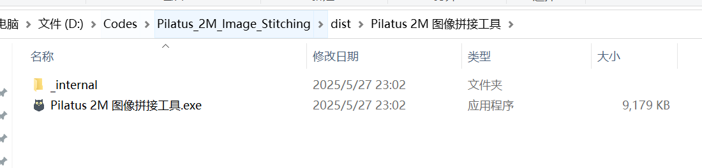

# Pilatus_2M_Image_Stitching

# Introduction

This code provides a solution to eliminate the GAP area of Pilatus 2M through motor movement. The code was developed and tested at SSRF BL02U2 beamline. Due to the GAP area in the PILATUS 2M detector motor, which affects the analysis of many 2D X-ray diffraction data, and since the GAP area is "#" shaped, three images from different motor positions need to be stitched together to completely eliminate the GAP area in the image center. The experimental principle is to move the detector using the motor, collect three images at different positions, and then stitch them together using this program to eliminate the GAP.

# Operation Guide
This code has been verified at BL02U2 beamline. Other beamlines may have different configurations.

The following steps will explain in detail how to achieve stitching to eliminate GAP:
## 1. Script Installation
Copy the file
```
spec_script/pic3.mac
```
to the SPEC computer and use
```
do pic3.mac
```
to enable the script in SPEC.
(Note: BL02U2 has already installed this script, no need to reinstall.)

## 2. Verify Motor Position
Fill in the exposure time, file path, file name, and other parameters

Enter in SPEC
```
wa
```

Record the current motor positions of detz and dety to ensure the motor can return to the initial position after collecting three images.

Enter the following command in the command line: here 'time' is a positive integer, for example, "pic3 1" means collecting three images with 1s exposure time.
```
pic3 time
```
After the movement is complete, enter
```
wa
```

After verification, the motor did not hit the limit during pic3 movement and returned to the initial position before stitching, proving the feasibility of this solution.

If the motor does not return to the initial position, adjust the motor to a suitable position for subsequent experiments.

<span style="color:red">This verification is fundamental for subsequent stitching experiments, please verify carefully.</span>

## 3. Running the Stitching Software
There are two ways to run the software: through source code or through the packaged software
### 3.1 Running from Source Code
Running from source code doesn't require considering the device platform, but requires some programming ability. The main entry point is mian.py.

However, it may throw errors on other machines due to missing Python packages, so this method is not recommended for users without Python programming skills.
### 3.2 Running from Installation Package
Copy the following folder to any Windows computer:

```
dist/Pilatus 2M Image Stitching Tool
```
<span style="color:red">Note: Make sure to copy the entire folder</span>

After opening the folder, the main file is "Pilatus 2M Image Stitching Tool.exe", double-click to run.


## 4. Using the Stitching Software
### 4.1 Three-Image Stitching
Select three images from the same group and drag them to the program interface

After processing, the result looks like this:

Images with "fix01" suffix are from the first stitching, and those with "fix02" suffix are from the second stitching.

### 4.2 Whole Folder Stitching
In the test folder, there are two groups of images that need stitching:

Drag the test folder directly to the program interface:

After stitching is complete, the program will show:

Then open the test folder, you can see two groups of data have been stitched:

Images with "fix01" suffix are from the first stitching, and those with "fix02" suffix are from the second stitching.

# 5. Author Information
Author: Pu Guo

Affiliation: Shanghai University, BL02U2 Beamline, Shanghai Synchrotron Radiation Facility, Shanghai Advanced Research Institute, Chinese Academy of Sciences

Email: godpoor@163.com

Statement: This code follows the MIT license, allowing anyone to use, copy, modify, merge, publish, distribute, sublicense, and sell the code, but requires attribution to the original author.

# 6. Citation Information

If you use this software in your research, please cite it using one of the following formats:

## APA Format (7th Edition)
```
Guo, P. (2025). Pilatus_2M_Image_Stitching [Computer software]. GitHub. https://github.com/godpoor/Pilatus_2M_Image_Stitching
```

## MLA Format (8th Edition)
```
Guo, Pu. "Pilatus_2M_Image_Stitching." GitHub, 2025, github.com/godpoor/Pilatus_2M_Image_Stitching.
```

## IEEE Format
```
P. Guo, "Pilatus_2M_Image_Stitching," GitHub, 2025. [Online]. Available: https://github.com/godpoor/Pilatus_2M_Image_Stitching
```

## GB/T 7714-2015 (Chinese Papers)
```
郭朴. Pilatus_2M_Image_Stitching: 消去PIlatus 2M的GAP区域的解决方案[CP/OL]. (2025)[2024-03-21]. https://github.com/godpoor/Pilatus_2M_Image_Stitching.
```

## BibTeX
```bibtex
@software{Pilatus_2M_Image_Stitching,
  author = {Guo, Pu},
  title = {Pilatus_2M_Image_Stitching},
  year = {2025},
  publisher = {GitHub},
  url = {https://github.com/godpoor/Pilatus_2M_Image_Stitching}
}
```

For more citation information, please refer to the `CITATION.cff` file in the project root directory.

# 7. Acknowledgments
Thanks to all the staff at SSRF BL02U2 for giving me a happy and memorable graduate student experience!
